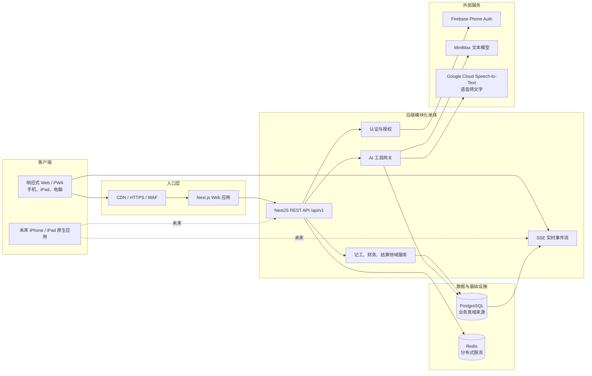
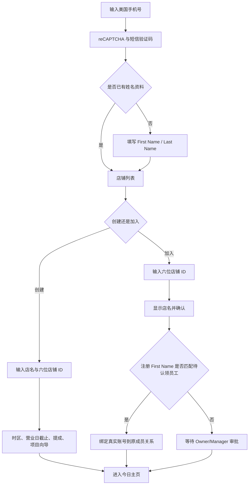
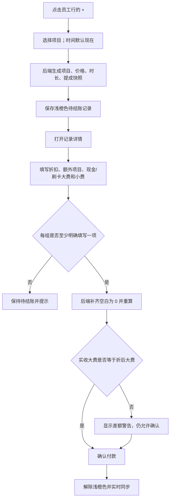
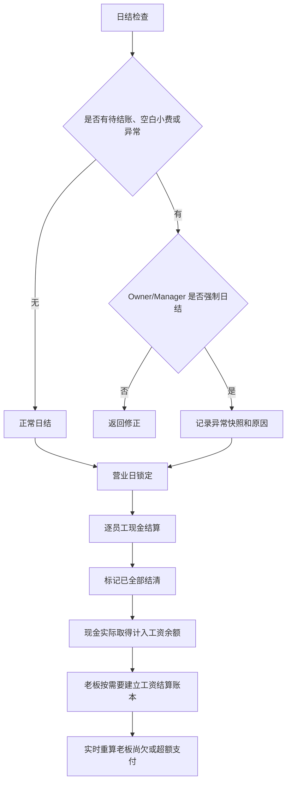
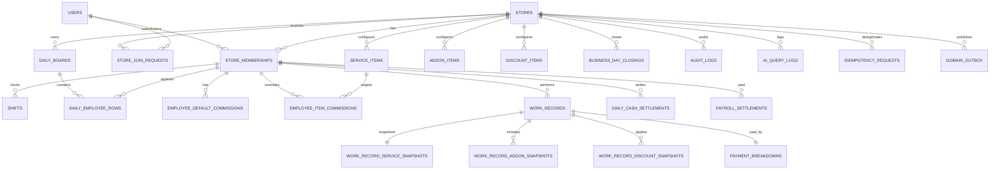
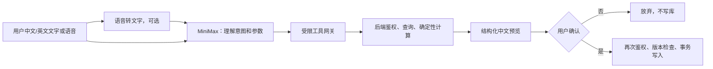

# 按摩店记工与财务管理系统：架构与实施计划

> 状态：已确认，2026-08-04 开始实施  
> 依据：`PRD.md` 与已确认的补充规则  
> 产品界面：第一版全部使用简体中文；代码、数据库字段和 API 路径使用英文内部命名

## 0. 已确认的设计结论

1. 权限角色与“是否参与记工”分离。Owner、Manager、Employee 都可参与记工。
2. 参与记工的经理进入普通工资结算；拥有者本人计算服务收入，但不产生“老板欠自己”。
3. 折扣不降低员工工资。
4. 金额非负，折扣不超过大费基数；退款以后使用独立冲正流程。
5. 现金不足时，只把员工实际拿到的现金算作“已通过现金取得”，不足部分仍由老板支付。
6. 日结后员工不能修改；拥有者或经理必须先取消日结。相关现金结算自动回到未结清。
7. 自定义项目使用员工默认提成，其次使用店铺全局提成；员工不能自行修改本单提成。
8. 付款确认时，大费拆分和小费拆分各至少明确填写一项，另一项留空自动转为 0。
9. 所有金额使用整数美分；所有服务项分别计算工资并四舍五入到美分。
10. 第一版不允许离线写入。断网时保留未提交表单并明确提示，恢复网络后由用户重新提交。

---

## 1. 系统架构

### 1.1 总体架构图



### 1.2 技术选型

| 层级 | 选型 | 理由 |
|---|---|---|
| Monorepo | pnpm workspaces | 使用工作区自带的受控运行环境，统一 TypeScript、契约、测试和脚本 |
| Web | Next.js App Router + TypeScript | 响应式页面、PWA、服务端首屏和未来多语言结构；采用官方当前推荐的 App Router |
| UI | React + 无障碍组件基础 + CSS 设计令牌 | 支持大字体、大按钮、高对比度和移动端适配，不依赖图标表达 |
| API | NestJS 模块化单体 | 权限、验证、事务和 SSE 结构明确；未来原生应用直接复用 REST API |
| 数据库 | PostgreSQL | 事务、约束、部分唯一索引、JSONB 审计和行级安全能力适合财务系统 |
| ORM | Prisma | 类型安全、迁移、事务和乐观锁实现清晰；复杂约束使用 SQL migration 补充 |
| 校验 | Zod（共享 API 契约）+ 后端 DTO 管道 | 前后端共享输入结构；后端仍是最终校验者 |
| 实时 | NestJS SSE + PostgreSQL Outbox | 客户端只需要接收“已变化”通知，SSE 更轻；事件持久化支持断线游标，多实例共同读取同一 PostgreSQL，断线后通过 REST 重新同步 |
| 登录 | Firebase Phone Auth + 后端安全会话 Cookie | 满足美国手机号验证码、reCAPTCHA、多设备和撤销全部会话 |
| AI | 自建 `LanguageModelProvider`，第一实现 MiniMax | AI 与业务工具隔离，可替换供应商；MiniMax 当前文本接口支持工具调用 |
| 语音 | 自建 `SpeechToTextProvider`，第一实现 Google Cloud STT | MiniMax 文本模型负责理解；语音识别独立替换，支持中英文短音频 |
| 测试 | Vitest + Supertest + Playwright | 领域公式、API 权限和端到端操作分层覆盖 |
| 部署 | 容器化 Web、API + 托管 PostgreSQL/Redis | 不绑定单一云平台，Web 与 API 可独立扩容；首版维护任务由受控计划任务执行 |

版本策略：编码开始时选择并锁定当日稳定版本，不使用浮动的 `latest`；每次升级必须经过财务、权限和迁移测试。

### 1.3 模块边界

```text
apps/
  web/          中文响应式 Web/PWA
  api/          REST API、SSE、认证、AI 与领域编排
packages/
  contracts/    Zod 请求/响应、事件和 AI 工具契约
  domain/       无框架依赖的金额、工资、营业日和权限规则
  ui/           老人友好组件和设计令牌
  config/       TypeScript、Lint、测试共享配置
```

后端保持“模块化单体”，第一版不拆微服务。核心模块为：Auth、Stores、Memberships、Catalog、Shifts、WorkRecords、Finance、BusinessDayClosing、CashSettlement、Payroll、Audit、Realtime、AI。

### 1.4 真相来源原则

- PostgreSQL 是业务数据唯一真相来源。
- SSE 事件只通知“数据已变化”，不作为最终数据。
- 前端不提交工资、合计或老板尚欠的最终值；后端从明细重算。
- 保存的汇总快照用于历史查询和审计，但必须由领域计算器生成。
- AI 输出只是候选参数，不能成为财务真相来源。

---

## 2. 页面与路由清单

所有可见标题、按钮、状态、错误、日期和金额说明均为中文。URL 使用稳定英文路径，避免以后翻译导致链接变化。

| 路由 | 页面 | 主要角色 | 移动端重点 |
|---|---|---|---|
| `/login` | 手机号登录、验证码 | 全部 | 数字键盘、重发倒计时、清晰错误 |
| `/onboarding/profile` | 首次填写姓名 | 全部 | 两个大输入框 |
| `/stores` | 我的店铺、切换店铺 | 全部 | 大卡片列表 |
| `/stores/new` | 创建店铺 | 全部 | 六位 ID 和重复校验 |
| `/stores/join` | 申请加入店铺 | 全部 | 先显示店名再确认 |
| `/s/[storeId]/setup` | 店铺设置向导 | Owner | 分步表单、可返回 |
| `/s/[storeId]/today` | 今日记工主页面 | 有效成员 | 手机员工卡片；横屏纸质表格 |
| `/s/[storeId]/day/[businessDate]` | 指定营业日主表格 | Owner/Manager | 历史状态、日结锁定提示 |
| `/s/[storeId]/records/[recordId]` | 记工详情 | 按权限 | 固定保存按钮、删除远离保存 |
| `/s/[storeId]/finance` | 全店财务 | Owner/Manager | 筛选抽屉、可展开明细 |
| `/s/[storeId]/my-finance` | 我的财务 | 参与记工成员 | 应得、已取得、已支付、尚欠 |
| `/s/[storeId]/cash/[businessDate]` | 每日现金结算 | Owner/Manager；员工只读自己 | 一人一卡、一键结清 |
| `/s/[storeId]/payroll` | 工资结算账本 | Owner/Manager | 新增支付、历史、撤销 |
| `/s/[storeId]/payroll/[settlementId]` | 工资结算详情 | Owner/Manager；员工只读自己的 | 展示计算组成 |
| `/s/[storeId]/close/[businessDate]` | 日结检查与日结 | Owner/Manager | 异常置顶、强制日结二次确认 |
| `/s/[storeId]/members` | 成员、申请、角色、参与记工 | Owner/Manager | 防误删、角色说明 |
| `/s/[storeId]/catalog/services` | 主要项目 | Owner/Manager | 排序、启停、价格和提成 |
| `/s/[storeId]/catalog/addons` | 额外项目 | Owner/Manager | 同上 |
| `/s/[storeId]/catalog/discounts` | 折扣项目 | Owner/Manager | 固定金额 |
| `/s/[storeId]/commissions` | 员工默认和特殊提成 | Owner/Manager | 显示生效优先级 |
| `/s/[storeId]/settings` | 店铺设置 | Owner/Manager | 时区、截止时间、店铺名称 |
| `/s/[storeId]/audit` | 操作日志 | Owner/Manager | 按日期、人员、对象筛选 |
| `/s/[storeId]/ai/work` | AI 记工助手 | 有效成员 | 文字、录音、结构化预览 |
| `/s/[storeId]/ai/finance` | AI 财务助手 | 按财务权限 | 回答必须带统计口径和明细入口 |

全局导航：今日、我的财务、AI；Owner/Manager 额外显示财务、结算、管理。手机底部导航最多四个主入口，其余放入“更多”。

---

## 3. 用户流程

### 3.1 注册、创建或加入店铺



### 3.2 快速记工与付款确认



### 3.3 日结、现金结算与工资结算



历史修正：先取消日结 → 相关现金结算回到未结清 → 修改记工 → 重新日结 → 重新确认现金；已有工资结算账本保留，余额自动重算并显示历史修改警告。

---

## 4. 角色权限矩阵

`参与记工`是成员属性，不是第四种角色。下表中的“自己”指该成员作为服务人员产生的数据。

| 能力 | Owner | Manager | Employee |
|---|---:|---:|---:|
| 查看当天全员记工 | 是 | 是 | 是 |
| 新增/修改/删除当天全员记工 | 是 | 是 | 是 |
| 修改已日结或历史记工 | 取消日结后 | 取消日结后 | 否 |
| 查看自己全部历史财务 | 是 | 是 | 是 |
| 查看他人历史财务 | 是 | 是 | 否 |
| 上下班打卡 | 参与记工时 | 参与记工时 | 参与记工时 |
| 使用记工 AI | 是 | 是 | 是 |
| 使用财务 AI | 全店 | 全店 | 仅自己 |
| 管理项目、折扣和提成 | 是 | 是 | 否 |
| 审批加入申请 | 是 | 是 | 否 |
| 只填名字预先创建员工 | 是 | 是 | 否 |
| 修改普通成员/经理角色 | 是 | 是 | 否 |
| 修改、移除或降级 Owner | 仅通过转移流程 | 否 | 否 |
| 指定其他 Manager | 是 | 是 | 否 |
| 日结、取消日结 | 是 | 是 | 否 |
| 现金结算 | 是 | 是 | 仅查看自己 |
| 工资结算 | 是 | 是 | 仅查看自己 |
| 查看全店审计 | 是 | 是 | 否 |
| 修改店铺设置 | 是 | 是 | 否 |
| 转移 Owner | 是 | 否 | 否 |
| 删除店铺 | 是 | 否 | 否 |

补充限制：

- 员工修改他人当天记录时，审计日志明确记录操作人和所属员工。
- 员工不能修改任何提成比例，即使该记录属于自己。
- Owner 本人服务收入进入经营统计，但排除在工资结算对象和“老板尚欠员工”之外。
- 所有权限由 API Guard、领域权限策略和数据库租户隔离共同执行，前端隐藏按钮不构成权限控制。

---

## 5. ER 图

为保持图可读性，只显示主要关系；详细快照、事件和审计字段见下一节。



---

## 6. 数据表与字段设计

### 6.1 通用约定

- 主键使用应用生成 UUID；六位店铺 ID 使用 `char(6)`，允许前导 0。
- 时间点使用 `timestamptz`；营业日使用店铺本地 `date`。
- 金额字段统一后缀 `_cents`，类型 `bigint`，正常业务输入 `>= 0`。
- 提成统一后缀 `_bps`，`60% = 6000`，范围 `0..10000`。
- 可修改聚合根带 `version integer`，从 1 开始。
- 软删除对象带 `deleted_at`、`deleted_by`、`delete_reason`。
- 业务表带 `created_at`、`updated_at`、`created_by`、`updated_by`。
- 租户业务表必须有 `store_id`，并建立以 `store_id` 开头的索引。

### 6.2 账号、店铺和成员

| 表 | 关键字段 | 约束与说明 |
|---|---|---|
| `users` | `firebase_uid`, `phone_e164`, `first_name`, `last_name`, `status` | `firebase_uid`、手机号唯一；手机号加密/受控展示 |
| `stores` | `store_code`, `name`, `timezone`, `business_cutoff_local`, `owner_membership_id`, `status`, `version` | `store_code` 全局唯一；时区为 IANA 名称；删除为软删除 |
| `store_memberships` | `store_id`, `user_id`, `role`, `display_name`, `is_service_provider`, `default_commission_bps`, `status`, `joined_at`, `left_at`, `version` | `user_id` 在预建员工认领前可为空；活跃显示名大小写不敏感唯一；每店仅一个活跃 Owner |
| `store_join_requests` | `store_id`, `user_id`, `requested_display_name`, `status`, `reviewed_by`, `reviewed_at`, `version` | 同一用户同店只允许一个待审批申请 |

Owner 转移在 `Serializable` 事务中锁定店铺和两条 membership，同时更新旧/新角色与 `owner_membership_id`。任何一步失败则整体回滚。

### 6.3 营业日、排班和表格

| 表 | 关键字段 | 约束与说明 |
|---|---|---|
| `shifts` | `store_id`, `membership_id`, `business_date`, `clock_in_at`, `clock_out_at`, `created_by` | 允许一天多段；同成员最多一条未下班记录 |
| `daily_boards` | `store_id`, `business_date`, `version` | 每店每营业日唯一；整日排序的并发令牌 |
| `daily_employee_rows` | `board_id`, `store_id`, `membership_id`, `position`, `is_hidden`, `added_by`, `version` | 每人每天一行；隐藏不影响记录和财务 |

营业日计算：把 `start_at` 转为店铺时区；若本地时间 `>= business_cutoff_local`，`business_date = 本地日期 + 1 天`，否则为本地日期。恰好截止时间归下一营业日。记录同时保存 `store_timezone_snapshot` 和 `business_cutoff_snapshot`；以后修改店铺设置不重分旧记录。

### 6.4 项目与提成

| 表 | 关键字段 | 约束与说明 |
|---|---|---|
| `service_items` | `store_id`, `full_name`, `short_name`, `default_commission_bps`, `position`, `is_enabled` | 项目身份与提成；旧时长/价格列仅用于滚动部署兼容 |
| `service_item_price_options` | `service_item_id`, `duration_minutes`, `price_cents`, `position` | 同一项目时长唯一；时长 1–720 分钟；价格非负 |
| `addon_items` | `store_id`, `name`, `short_name`, `amount_cents`, `duration_minutes`, `default_commission_bps`, `position`, `is_enabled` | 时长可空 |
| `discount_items` | `store_id`, `name`, `short_name`, `amount_cents`, `position`, `is_enabled` | 只支持固定金额 |
| `employee_default_commissions` | `store_id`, `membership_id`, `commission_bps`, `effective_from`, `effective_to` | 保留时间段历史，不覆盖旧值 |
| `employee_item_commissions` | `store_id`, `membership_id`, `item_type`, `item_id`, `commission_bps`, `effective_from`, `effective_to` | 项目级特殊比例；时间段不得重叠 |

`store_memberships.default_commission_bps` 可作为当前值缓存，历史和生效区间以 commission 表为准。实际记工永远保存最终比例快照。

### 6.5 记工与快照

| 表 | 关键字段 | 约束与说明 |
|---|---|---|
| `work_records` | `store_id`, `employee_membership_id`, `business_date`, `start_at`, `end_at`, `actual_duration_minutes`, `status`, `note`, 各汇总金额、`version` | `status = pending_payment / confirmed`；软删除；汇总只由服务器写 |
| `work_record_service_snapshots` | `work_record_id`, `source_service_item_id`, `is_custom`, `name`, `short_name`, `amount_cents`, `duration_minutes`, `commission_bps`, `wage_cents` | 一单一个；改项目时更新当前快照，同时在审计中保留旧值 |
| `work_record_addon_snapshots` | `work_record_id`, `source_addon_item_id`, `is_custom`, `name`, `short_name`, `amount_cents`, `duration_minutes`, `commission_bps`, `wage_cents`, `position` | 一单多个 |
| `work_record_discount_snapshots` | `work_record_id`, `source_discount_item_id`, `is_custom`, `name`, `amount_cents`, `position` | 一单多个；总额不得超过大费基数 |
| `payment_breakdowns` | `work_record_id`, `cash_service_cents`, `card_service_cents`, `cash_tip_cents`, `card_tip_cents`, `confirmed_at`, `confirmed_by`, `version` | 待结账时可空；确认后四项均非空、非负 |

`work_records` 的服务器汇总字段：

- `main_service_amount_cents`
- `addon_total_cents`
- `gross_fee_base_cents`
- `discount_total_cents`
- `discounted_fee_performance_cents`
- `cash_service_cents`
- `card_service_cents`
- `cash_tip_cents`（待结账可空）
- `card_tip_cents`（待结账可空）
- `total_tip_cents`（待结账可空）
- `actual_service_collected_cents`
- `customer_total_paid_cents`（待结账可空）
- `main_service_wage_cents`
- `addon_wage_cents`
- `total_large_fee_wage_cents`
- `employee_total_income_cents`（小费未知时为临时值，并带 incomplete 标记）
- `cash_allocated_service_wage_cents`
- `cash_acquired_service_wage_cents`
- `cash_wage_shortfall_cents`

待结账记录的大费工资仍计入“今日临时统计”，但空白小费不能静默伪装成已确认的 0；API 同时返回 `incomplete_record_count`。正常日结要求补全，强制日结才允许带着异常快照继续。

### 6.6 日结、现金和工资账本

| 表 | 关键字段 | 约束与说明 |
|---|---|---|
| `business_day_closings` | `store_id`, `business_date`, `cycle_no`, `status`, `is_forced`, `warning_snapshot_json`, `totals_snapshot_json`, `closed_by`, `closed_at`, `cancelled_by`, `cancelled_at`, `version` | 每次重新日结创建新周期；同一营业日最多一个有效关闭周期 |
| `daily_cash_settlements` | `store_id`, `business_date`, `membership_id`, 各现金快照金额、`status`, `note`, `settled_by`, `settled_at`, `version` | 每人每天一条当前记录；结清时保存计算快照；修改历史后回到未结清 |
| `payroll_settlements` | `store_id`, `membership_id`, `settlement_date`, `period_start`, `period_end`, `service_wage_cents`, `cash_tip_cents`, `card_tip_cents`, `adjustment_cents`, `total_paid_cents`, `payment_method`, `note`, `version` | Owner 不能作为被支付对象；总额由服务器计算；软删除 |

日期范围是账本说明和筛选维度，不锁定或“占用”某批记工；允许日期范围重叠。老板尚欠始终按累计应得、已通过结清现金取得和有效工资账本重新计算，因此部分支付、超额支付和历史修正不会产生双重归属逻辑。

### 6.7 审计、可靠性和 AI

| 表 | 关键字段 | 约束与说明 |
|---|---|---|
| `audit_logs` | `store_id`, `actor_user_id`, `actor_membership_id`, `action`, `entity_type`, `entity_id`, `business_date`, `before_json`, `after_json`, `reason`, `request_id`, `created_at` | 只追加，不更新、不软删除；与业务写入同事务 |
| `idempotency_requests` | `store_id`, `user_id`, `key`, `route`, `request_hash`, `status`, `response_code`, `response_json`, `expires_at` | `(store_id,user_id,key,route)` 唯一；相同键不同请求体返回冲突 |
| `domain_outbox` | `store_id`, `topic`, `aggregate_type`, `aggregate_id`, `payload_json`, `created_at`, `published_at`, `attempt_count` | 与业务审计同事务写；SSE 按游标至少一次投递，客户端收到后重新拉取 REST 真相 |
| `ai_conversations` | `store_id`, `user_id`, `assistant_type`, `created_at`, `last_message_at` | 会话按店隔离 |
| `ai_query_logs` | `conversation_id`, `store_id`, `user_id`, `model_provider`, `model_name`, `input_text`, `tool_calls_json`, `tool_results_redacted_json`, `outcome`, `latency_ms`, `created_at` | 不保存音频；敏感字段脱敏；可配置保留期 |
| `ai_change_previews` | `store_id`, `user_id`, `operation`, `canonical_payload_json`, `base_versions_json`, `warnings_json`, `expires_at`, `confirmed_at`, `consumed_at` | 一次性预览；确认时重新鉴权、重算和检查版本 |

### 6.8 关键数据库约束

- 活跃 Owner：每个 `store_id` 仅一个 `role='OWNER'` 的活跃 membership。
- 活跃显示名：`(store_id, lower(display_name))` 部分唯一。
- 店铺代码：六位数字正则检查并全局唯一。
- 所有快照金额非负；折扣总额通过领域事务校验不超过大费基数。
- 提成 `0..10000 bps`。
- `end_at >= start_at`；允许跨营业日截止，但业务日期不改变。
- 已确认付款四个拆分字段均非空。
- 所有 store-scoped 外键尽量采用 `(store_id, id)` 组合约束，防止错误跨店关联。

---

## 7. 财务公式、舍入与边界案例

### 7.1 基础金额

设：

- `P`：主要项目金额
- `Ei`：第 i 个额外项目金额，`E = ΣEi`
- `D`：折扣总额
- `CS`：现金大费
- `CC`：刷卡大费
- `CT`：现金小费
- `CCT`：刷卡小费

```text
大费基数 = P + E
折后大费业绩 = P + E - D
实收服务费 = CS + CC
收款差额 = 实收服务费 - 折后大费业绩
小费总额 = CT + CCT
客人总付款 = CS + CC + CT + CCT
```

界面建议标签：`大费总额（折扣前）`、`折后大费`、`实际收到大费`、`收款差额`，避免把“实收服务费”误解为软件服务费。

### 7.2 提成与工资

```text
主要项目工资 = round_half_up(P × main_rate_bps / 10000)
单项额外项目工资_i = round_half_up(Ei × addon_rate_i_bps / 10000)
额外项目工资 = Σ单项额外项目工资_i
大费工资 W = 主要项目工资 + 额外项目工资
员工应得总收入 = W + CT + CCT
```

必须逐项舍入后再相加，不能先把项目合并再乘一个比例。折扣不进入工资公式。

### 7.3 混合付款现金分摊

每条记录独立计算：

```text
若 CS + CC > 0：
  现金对应大费工资 A = round_half_up(W × CS / (CS + CC))
否则：
  A = 0，并产生“实收服务费为 0”异常

实际通过现金取得的大费工资 AC = min(CS, A)
现金工资不足 S = A - AC
```

为了保证分摊后精确相加，刷卡侧对应工资使用 `W - A`，不单独再次除法舍入。

每位员工每日：

```text
员工共收到现金 = ΣCS + ΣCT
实际通过现金取得 = ΣAC + ΣCT
员工应提交店铺现金 = ΣCS - ΣAC
现金工资不足 = ΣS
```

应提交金额不会为负。只有该员工当天现金结算标记为“已全部结清”后，`ΣAC + ΣCT` 才进入累计“已通过现金取得”。

### 7.4 老板尚欠与超额支付

不含 Owner 本人的记录：

```text
原始余额 B = 累计员工应得总收入
             - 已通过已结清现金结算实际取得
             - 有效工资结算账本累计 total_paid

老板尚欠 = max(B, 0)
已超额支付 = max(-B, 0)
```

工资账本：

```text
total_paid = service_wage + cash_tip + card_tip + adjustment
```

前三项非负，`adjustment` 可正可负。若最终总额为负，必须额外二次确认并填写原因；该条账本相当于冲减既有支付，但不修改历史记工。

### 7.5 完整示例

主要项目 $100、提成 60%；额外项目 $20、提成 50%；折扣 $15；现金大费 $40、刷卡大费 $65；现金小费 $10、刷卡小费 $20：

| 项目 | 结果 |
|---|---:|
| 大费基数 | $120.00 |
| 折后大费业绩 | $105.00 |
| 实收服务费 | $105.00 |
| 主要项目工资 | $60.00 |
| 额外项目工资 | $10.00 |
| 大费工资 | $70.00 |
| 员工应得总收入 | $100.00 |
| 现金对应大费工资 | $26.67 |
| 实际通过现金取得 | $26.67 + $10.00 = $36.67 |
| 应提交店铺现金 | $40.00 - $26.67 = $13.33 |
| 工资结算前老板尚欠 | $100.00 - $36.67 = $63.33 |

### 7.6 必测边界

1. 全现金、全刷卡、无小费、明确输入 0。
2. 大费刷卡而小费现金；大费现金而小费刷卡。
3. 大费现金/刷卡混合，产生半美分舍入。
4. 多个额外项目使用不同提成。
5. 多个折扣，折扣正好等于大费基数。
6. 折扣后 $0，但员工仍有工资；现金不足的工资缺口进入老板尚欠。
7. 实收少于、等于和多于折后大费。
8. 实收服务费为 0。
9. 提成优先级四层和自定义项目两层。
10. 修改模板和提成后，历史工资不变。
11. 日结后取消、修改、重新日结，现金状态回退。
12. 部分工资支付、超额支付、负数调整、删除和恢复账本。
13. Owner 参与记工但不产生老板尚欠；Manager 参与记工并产生余额。
14. 小费空白与明确 0 的差别。

---

## 8. API 设计

### 8.1 通用规范

- 前缀：`/api/v1`。
- JSON 金额统一传整数美分；API 响应可额外给 `formatted` 中文展示值。
- 所有资源响应带 `id`、`version`、`updatedAt`。
- POST/PATCH/DELETE 必须带 `Idempotency-Key`；更新和删除必须带预期 `version`。
- 店铺从路径取得，后端核验 membership；不信任请求体中的 `storeId`。
- 错误结构：`code`、`messageZh`、`fieldErrors`、`requestId`、可选 `latestResource`。
- 分页使用游标；财务导出和明细查询使用稳定排序。

### 8.2 认证和账号

| 方法 | 路径 | 说明 |
|---|---|---|
| POST | `/auth/session` | 用 Firebase ID token 换后端 HttpOnly 会话 |
| DELETE | `/auth/session` | 退出当前设备 |
| DELETE | `/auth/sessions` | 撤销 Firebase refresh tokens，退出全部设备 |
| GET | `/me` | 当前用户、店铺 membership 摘要 |
| PATCH | `/me/profile` | 首次或后续修改姓名 |

### 8.3 店铺与成员

| 方法 | 路径 | 说明 |
|---|---|---|
| POST | `/stores` | 创建店铺和 Owner membership |
| GET | `/stores/resolve-code/:code` | 返回可公开的店名，不泄露成员信息 |
| GET/PATCH/DELETE | `/stores/:storeId` | 读取、修改、软删除店铺 |
| POST | `/stores/:storeId/owner-transfer` | 原子转移 Owner |
| POST | `/stores/:storeId/join-requests` | 申请加入 |
| GET | `/stores/:storeId/join-requests` | Owner/Manager 查看待审批 |
| POST | `/stores/:storeId/join-requests/:id/approve` | 审批 |
| POST | `/stores/:storeId/join-requests/:id/reject` | 拒绝 |
| GET/PATCH/DELETE | `/stores/:storeId/members/:membershipId` | 成员、角色、参与记工、离职 |
| POST | `/stores/:storeId/members` | Owner/Manager 只填名字创建待认领员工 |
| POST | `/stores/:storeId/members/:membershipId/restore` | 恢复成员关系 |

### 8.4 排班、今日表格和记工

| 方法 | 路径 | 说明 |
|---|---|---|
| GET | `/stores/:storeId/business-days/current` | 返回服务器认定的当前营业日 |
| GET | `/stores/:storeId/boards/:businessDate` | 整日表格、记录和统计快照 |
| POST | `/stores/:storeId/shifts/clock-in` | 上班并确保今日行存在 |
| POST | `/stores/:storeId/shifts/:shiftId/clock-out` | 下班 |
| POST | `/stores/:storeId/boards/:date/rows` | Owner/Manager 手动加人 |
| PATCH | `/stores/:storeId/boards/:date/rows/:rowId` | 隐藏/显示 |
| POST | `/stores/:storeId/boards/:date/reorder` | 以 board version 原子排序 |
| POST | `/stores/:storeId/work-records` | 快速创建待结账记录 |
| GET | `/stores/:storeId/work-records/:recordId` | 详情和审计摘要 |
| PATCH | `/stores/:storeId/work-records/:recordId` | 修改项目、时间、金额等 |
| POST | `/stores/:storeId/work-records/:recordId/confirm-payment` | 补 0、重算并确认付款 |
| DELETE | `/stores/:storeId/work-records/:recordId` | 软删除 |
| POST | `/stores/:storeId/work-records/:recordId/restore` | Owner/Manager 恢复 |

### 8.5 财务、日结和结算

| 方法 | 路径 | 说明 |
|---|---|---|
| GET | `/stores/:storeId/finance/summary` | 按日期、人员、支付方式、金额类型汇总 |
| GET | `/stores/:storeId/finance/details` | 组成明细 |
| GET | `/stores/:storeId/finance/my-balance` | 当前用户自己的累计余额 |
| GET | `/stores/:storeId/closings/:date/preview` | 日结检查和异常 |
| POST | `/stores/:storeId/closings/:date` | 正常或强制日结 |
| POST | `/stores/:storeId/closings/:date/cancel` | 取消日结并回退现金状态 |
| GET | `/stores/:storeId/cash-settlements/:date` | 每日现金计算 |
| POST | `/stores/:storeId/cash-settlements/:date/:membershipId/settle` | 标记全部结清 |
| POST | `/stores/:storeId/cash-settlements/:date/:membershipId/reopen` | 取消结清 |
| POST | `/stores/:storeId/cash-settlements/:date/settle-all` | 一键结清 |
| GET/POST | `/stores/:storeId/payroll-settlements` | 列表、新增账本 |
| GET/PATCH/DELETE | `/stores/:storeId/payroll-settlements/:id` | 查看、修改、软删除 |
| POST | `/stores/:storeId/payroll-settlements/:id/restore` | 恢复 |

### 8.6 设置、审计和 AI

项目、额外项目、折扣和提成分别使用标准 `/stores/:storeId/...` CRUD API；删除均为软删除。审计使用 `GET /stores/:storeId/audit-logs`。

| 方法 | 路径 | 说明 |
|---|---|---|
| POST | `/stores/:storeId/ai/work/messages` | 发送文字，模型只能调用记工工具 |
| POST | `/stores/:storeId/ai/work/transcribe` | 上传短音频并返回文字，不直接执行 |
| POST | `/stores/:storeId/ai/finance/messages` | 财务问答，只读工具 |
| GET | `/stores/:storeId/ai/previews/:previewId` | 获取结构化预览 |
| POST | `/stores/:storeId/ai/previews/:previewId/confirm` | 用户确认后执行一次 |
| DELETE | `/stores/:storeId/ai/previews/:previewId` | 放弃预览 |

---

## 9. 实时同步与并发冲突

### 9.1 事件流

1. API 在数据库事务中更新业务数据、审计日志和 `domain_outbox`。
2. 提交成功后立即响应客户端。
3. 已认证 SSE 连接按 `storeId` 和 `lastEventId` 从 outbox 顺序读取事件；无事件时发送心跳。
4. 客户端收到 `store.changed` 后防抖并重新获取当前页面的 REST 真相。
5. outbox 保留 7 天供短期重连；游标已过保留期时，页面初次加载本身会重新读取完整快照。

主要事件：`work_record.created/updated/deleted/restored`、`board.reordered`、`shift.changed`、`closing.changed`、`cash_settlement.changed`、`payroll.changed`、`catalog.changed`、`membership.changed`。

事件只包含 `eventId`、`storeId`、`businessDate`、`resourceType`、`resourceId`、`version`、`occurredAt`，不广播完整敏感财务数据。

### 9.2 乐观锁

- PATCH/DELETE 使用 `WHERE id = ? AND store_id = ? AND version = expectedVersion`。
- 0 行更新返回 HTTP 409，并带最新资源。
- 记工金额、员工归属、付款拆分等财务字段不自动合并；用户查看差异后重试。
- 备注也使用整体 version，避免静默覆盖。
- 拖动排序以 `daily_boards.version` 为整板令牌，在单事务内更新全部 position。

### 9.3 幂等与重复点击

- 客户端每次用户操作生成唯一 `Idempotency-Key`，网络重试复用同一个键。
- 相同键、路径和请求体返回第一次结果，不再次写入。
- 相同键但不同请求体返回 409 `IDEMPOTENCY_KEY_REUSED`。
- AI 预览确认还带一次性 `previewId`，消费后不能再次执行。

### 9.4 断网和重新连接

- 第一版不支持离线新增、修改或删除，避免多设备离线账务冲突。
- 已编辑的记工详情以记录版本为保护保留在本机最多 7 天；断网时禁用提交并显示“网络中断，内容尚未保存”。退出登录会清除本应用草稿。
- 请求超时但结果未知时，客户端用同一幂等键查询/重试。
- EventSource 重连自动提交 `Last-Event-ID`；页面首次进入和事件通知后都通过 REST 获取最新快照。
- PWA 只缓存应用壳和静态资源，不把敏感财务响应长期缓存到共享浏览器缓存。

---

## 10. 审计日志方案

### 10.1 写入范围

记工新增/修改/删除/恢复、备注修改、付款确认、打卡、排序、隐藏、日结/取消、现金结清/回退、工资账本、角色、参与记工状态、提成、项目、店铺设置、Owner 转移、AI 确认写入均审计。

### 10.2 原则

- 审计与业务写入位于同一数据库事务。
- `before_json` 和 `after_json` 使用稳定字段名并保存金额美分值。
- 每条日志记录 actor、目标员工、店铺、营业日、请求 ID、幂等键摘要、操作来源 `web/api/ai/system`。
- 自动状态回退使用 `actor = system`，并记录触发该回退的父 `request_id`。
- 审计表只追加，应用账号没有 UPDATE/DELETE 权限。
- 手机号、Firebase token、Cookie、MiniMax 密钥、完整音频不得写入审计。

### 10.3 查看权限

- Owner/Manager 可查看本店完整审计。
- Employee 可在自己有权查看的记录详情中看到简化修改历史；历史日期只显示自己的记录历史。
- 跨店审计查询由服务层强制店铺作用域、对象归属校验和非超级用户数据库账号共同拒绝，并有真实 PostgreSQL 集成测试。

---

## 11. AI 工具调用协议

### 11.1 分层



### 11.2 允许工具

| 工具 | 类型 | 权限与用途 |
|---|---|---|
| `get_today_work_records` | 读 | 所有有效成员看当日；返回受控字段 |
| `get_work_record_candidates` | 读 | 根据姓名、时间、项目查找待修改记录 |
| `prepare_create_work_record` | 预览 | 生成新增草案，不写业务表 |
| `prepare_update_today_work_record` | 预览 | 只能修改调用者有权修改的今日记录 |
| `prepare_delete_today_work_record` | 预览 | 删除预览必须包含完整记录和二次确认文案 |
| `calculate_employee_finance` | 读 | Employee 只能自己；Owner/Manager 本店指定成员 |
| `calculate_store_finance` | 读 | Owner/Manager 本店 |
| `get_daily_cash_settlement` | 读 | Employee 只能自己；管理者本店 |
| `get_payroll_balance` | 读 | Employee 只能自己；管理者本店 |
| `get_finance_breakdown` | 读 | 为答案提供可追溯组成明细 |

不向模型暴露 `store_id` 选择权。工具网关从已认证会话注入 store、user、membership 和权限上下文。

### 11.3 预览格式

```json
{
  "previewId": "uuid",
  "operation": "UPDATE_WORK_RECORD",
  "expiresAt": "ISO-8601",
  "target": {
    "recordId": "uuid",
    "employeeDisplayName": "Amy",
    "businessDate": "2026-08-04"
  },
  "before": {},
  "after": {},
  "computed": {},
  "warnings": [],
  "baseVersions": { "workRecord": 4 }
}
```

确认时只发送 `previewId` 和明确确认动作；服务器从数据库读取 canonical payload，不接受客户端替换后的 `after`。预览默认 10 分钟过期，执行一次后作废。

### 11.4 AI 安全边界

- 无任意 SQL、无任意 URL、无通用文件或代码执行工具。
- 模型工具参数经过 Zod 严格模式校验，未知字段拒绝。
- 权限在工具调用和最终确认两个时间点分别检查。
- 所有金额计算调用领域计算器；模型只解释返回结果。
- 财务回答必须显示店铺、日期范围、员工范围和口径。
- 同名或多条记录无法唯一确定时必须追问，不能猜。
- 删除必须明确说出员工、时间、项目和金额，并进行二次确认。
- AI 查询、工具参数、脱敏结果和最终状态写入 AI 日志；音频转写成功后立即删除临时音频。

### 11.5 语音方案

- 浏览器录制最长 60 秒短音频，经 API 发给 `SpeechToTextProvider`。
- 第一实现使用 Google Cloud Speech-to-Text，语言候选为普通话和美式英语；转写结果先展示为可编辑文字。
- 用户必须确认/修改转写文字后才交给 MiniMax 理解。
- MiniMax 作为 `LanguageModelProvider` 负责文本和工具调用，不与语音供应商耦合。
- 若语音服务未配置或失败，保留文字输入和系统键盘听写作为降级路径。

---

## 12. 安全与错误处理

### 12.1 认证

- 只接受标准化 `+1` E.164 手机号。
- Firebase Web Phone Auth 使用 reCAPTCHA、区域策略和测试号码。
- Web 登录成功后用 Firebase ID token 换取 `Secure`、`HttpOnly`、`SameSite=Lax` 会话 Cookie。
- 当前设备退出只清 Cookie；全部设备退出调用 Firebase refresh token 撤销，并更新用户 `tokens_valid_after`。
- 未来原生应用可使用 Firebase ID token Bearer；两种方式归一为同一 AuthContext。

### 12.2 授权与多店隔离

每个请求执行：认证用户 → 从 URL 解析 store → 查询有效 membership → 角色策略 → 数据归属检查。Repository API 必须要求 `TenantContext`，不提供无 store 的业务查询方法。

生产业务连接使用非表拥有者、非超级用户、不可 `BYPASSRLS` 的独立角色；迁移和维护使用不能被 Web 请求调用的管理账号。首版由所有业务查询强制 `storeId`、对象归属检查和跨店集成测试实现租户隔离。没有在 Prisma 连接池上伪造依赖会话变量的 RLS；将来若引入请求级事务 Unit of Work，再把真正的 RLS 作为额外纵深防御。

### 12.3 Web 安全

- 登录换取会话使用双提交 CSRF token；其余 Cookie 写请求使用 `SameSite=Lax` 与精确 Origin 校验。
- CSP、HSTS、`X-Content-Type-Options`、严格来源校验。
- 所有文本按纯文本渲染；备注和 AI 内容不执行 HTML。
- 登录、加入店铺、AI、导出和敏感修改分别限流。
- 生产日志不记录 token、Cookie、完整手机号或 AI 密钥。
- 环境变量分 Web 公开配置与 API 私密配置；密钥只存在服务端。

### 12.4 备份与恢复

- PostgreSQL 每日备份和时间点恢复；上线前进行一次恢复演练。
- 迁移先备份，使用向前兼容的 expand/migrate/contract 策略。
- 财务审计和历史快照在店铺存续期间长期保留；软删除不会立即物理清除。

### 12.5 错误分类

| HTTP | 代码示例 | 中文提示 |
|---:|---|---|
| 400 | `VALIDATION_ERROR` | 请检查标红内容 |
| 401 | `AUTH_REQUIRED` | 登录已过期，请重新登录 |
| 403 | `FORBIDDEN` | 你没有权限执行此操作 |
| 404 | `NOT_FOUND` | 记录不存在或已被删除 |
| 409 | `VERSION_CONFLICT` | 此记录刚被别人修改，请查看最新内容 |
| 409 | `DAY_CLOSED` | 此营业日已日结，请先取消日结 |
| 422 | `PAYMENT_INCOMPLETE` | 请至少填写一种大费和一种小费金额 |
| 422 | `DISCOUNT_EXCEEDS_GROSS` | 折扣不能超过大费总额 |
| 429 | `RATE_LIMITED` | 操作太频繁，请稍后再试 |
| 503 | `AI_PROVIDER_UNAVAILABLE` | AI 暂时不可用，你仍可手动记工 |

所有错误带 `requestId`。未知错误不向客户端暴露堆栈、SQL 或内部服务信息。

---

## 13. 测试计划

### 13.1 测试金字塔

| 层级 | 工具 | 重点 |
|---|---|---|
| 领域单元测试 | Vitest | 金额、舍入、提成、营业日、权限纯函数 |
| 数据库集成测试 | Vitest + 独立 PostgreSQL 测试库 | 事务、唯一约束、跨店作用域、软删除、Owner 转移 |
| API 集成测试 | Supertest | AuthContext、角色、幂等、409、审计、响应契约 |
| Web 组件测试 | Testing Library | 大按钮、中文错误、表单空白与 0、键盘操作 |
| 端到端测试 | Playwright | 手机、iPad 横屏、桌面三种视口的核心流程 |
| 并发测试 | API 并发脚本 | 双击、旧版本覆盖、排序冲突、重复 AI 确认 |

### 13.2 财务测试矩阵

- 单一现金、单一刷卡、混合大费、跨方式小费。
- 多额外项目、多折扣、免费服务、少收、多收、实收为 0。
- 每个提成优先级和自定义项目优先级。
- 每项分别舍入，以及现金/刷卡分摊总和不丢失美分。
- 折扣不减少工资；现金不足不虚增已取得收入。
- 现金结算未结清/已结清切换对老板尚欠的影响。
- 工资部分支付、超付、负调整、删除和恢复。
- Owner 与 Manager 同时参与记工的不同余额行为。

### 13.3 权限与隔离测试

为每个 API 至少测试 Owner、Manager、Employee、离职成员、无 membership、另一店成员六种身份。特别验证：

- Employee 无法读取他人历史财务。
- 请求体伪造 `store_id` 无效。
- 跨店资源 ID 返回 404/403，不泄露存在性。
- Manager 不能转移 Owner 或删除店铺。
- 日结后 Employee 写入被拒绝。
- AI 工具和最终确认均执行同样权限检查。
- 所有跨店 ID 探测均返回拒绝或不可见，且不能修改另一店对象；测试使用真实 PostgreSQL 约束与服务查询。

### 13.4 历史与审计测试

- 修改项目模板、价格、简称、提成后旧记录完全不变。
- 删除/恢复项目和成员不破坏历史。
- 每个关键写操作与审计同事务成功或回滚。
- 修改已结算历史会取消日结、回退现金状态并保留工资账本。
- 同一幂等请求重复 100 次只产生一次业务变化和一次审计。

### 13.5 非功能验收

- 手机常用快速记工不超过 3 步。
- 主要触控目标至少适合手指点击，支持系统字体放大。
- 表单错误使用中文并聚焦到首个错误。
- 今日表格在目标正常数据量下交互流畅；财务长查询有分页和超时。
- 断网、请求超时、SSE 重连均不会静默丢失或重复写入。

---

## 14. 分阶段开发计划

每一阶段都必须通过该阶段测试后才能进入下一阶段。不会先做“假财务演示”再补权限或审计。

### 阶段 0：工程骨架与契约

- Monorepo、TypeScript、Lint、测试、环境变量模板。
- PostgreSQL/Redis 本地环境、迁移框架、CI。
- 金额、提成、营业日、错误和 API 契约包。

退出标准：测试和类型检查可重复运行；没有业务页面。

### 阶段 1：认证、多店和成员

- Firebase 手机登录和后端会话。
- 创建/加入/审批店铺，角色、参与记工、Owner 原子转移。
- 多店隔离、独立数据库运行账号、审计基础、中文设置向导。

退出标准：权限矩阵和跨店隔离自动化测试通过。

### 阶段 2：项目、提成、打卡和今日表格

- 三类项目配置和提成优先级。
- 上下班、每日员工行、隐藏和实时排序。
- 手机卡片与桌面/iPad 横向表格。

退出标准：多设备能看到打卡和排序同步；并发冲突不覆盖数据。

### 阶段 3：记工、付款和财务引擎

- 快速记工、详情、快照、软删除和恢复。
- 付款拆分、空白/0、多个额外项目和折扣。
- 确定性财务计算器和所有边界测试。

退出标准：PRD 财务验收矩阵全部自动化通过。

### 阶段 4：日结、现金结算、工资账本

- 正常/强制/取消/再次日结。
- 现金不足规则、单人/全部结清、回退。
- 工资部分支付、超付、负调整和老板尚欠。

退出标准：历史修正链路和余额测试通过，所有写入有审计。

### 阶段 5：财务查询、导出基础和完整实时同步

- 财务筛选、汇总、可点击组成明细。
- CSV 第一实现；Excel/PDF 接口预留但若 PRD 第一版只要求架构预留则不强行实现。
- Outbox、SSE、断线游标重同步和并发提示。

退出标准：多设备测试、幂等测试、财务查询权限测试通过。

### 阶段 6：AI 记工和财务助手

- MiniMax Provider、受限工具、结构化预览、确认执行。
- Google Cloud STT Provider、录音转写与文字确认。
- AI 权限、提示注入、重复确认和日志测试。

退出标准：AI 无法越权、无法跳过预览、无法自行计算或写财务账本。

### 阶段 7：PWA、无障碍、部署与交付

- PWA 安装、中文帮助、老人友好可用性调整。
- Docker、生产配置、备份恢复、监控和部署说明。
- Seed 数据、Firebase/MiniMax/STT 配置、API 文档、员工及管理者使用说明。

退出标准：端到端验收、恢复演练和发布清单全部通过。

---

## 15. 编码开始后的完成定义

一个功能只有同时满足以下条件才算完成：

1. 中文 Web 界面可使用，手机和横屏布局均验证。
2. 后端权限和 store 隔离已测试，不依赖前端隐藏。
3. 财务金额由共享领域计算器产生，整数美分且有边界测试。
4. 关键操作有同事务审计、幂等键和乐观锁。
5. 历史快照不受配置修改影响。
6. 实时事件失败不影响已提交业务，重连可恢复一致状态。
7. API、环境变量和使用说明同步更新。

---

## 16. 实施时参考的官方资料

- [Next.js App Router](https://nextjs.org/docs/app)
- [NestJS Server-Sent Events](https://docs.nestjs.com/techniques/server-sent-events)
- [Firebase Web Phone Authentication](https://firebase.google.com/docs/auth/web/phone-auth)
- [Firebase Session Cookies](https://firebase.google.com/docs/auth/admin/manage-cookies)
- [PostgreSQL Row Security Policies](https://www.postgresql.org/docs/current/ddl-rowsecurity.html)
- [Prisma Transactions and Optimistic Concurrency](https://www.prisma.io/docs/orm/prisma-client/queries/transactions)
- [MiniMax Text Generation and Tool Calls](https://platform.minimax.io/docs/api-reference/text-post)
- [Google Cloud Speech-to-Text](https://cloud.google.com/speech-to-text/docs)
