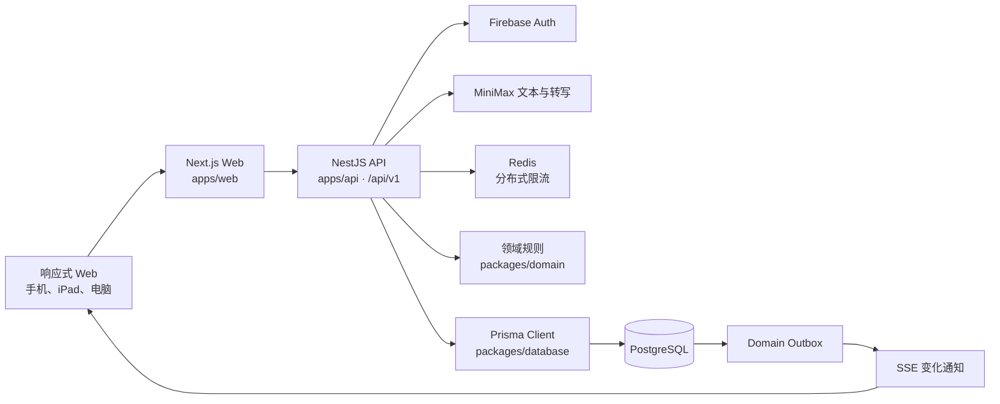

# 当前架构

> 状态：与 `0.12.30` 代码结构核对。
> 本文描述当前实现；项目开始时的设计草案见 [`archive/INITIAL_ARCHITECTURE_PLAN.md`](archive/INITIAL_ARCHITECTURE_PLAN.md)。

Massage note 是一个 pnpm workspace 管理的 TypeScript 模块化单体。Web、API 和共享包在同一仓库开发与测试，生产可以按 Web/API 双容器运行，也可以在群晖单镜像中同时运行。

## 系统全景



核心原则：PostgreSQL 是业务真相来源；SSE 只通知客户端重新读取 REST；AI 只生成候选参数或解释确定性查询结果。

## 仓库边界

| 路径 | 职责 | 不应承担 |
| --- | --- | --- |
| `apps/web` | Next.js App Router、响应式中英文 UI、API 客户端和本地草稿 | 最终权限判断、最终财务计算 |
| `apps/api` | REST、认证、授权、事务、领域编排、审计、outbox、SSE 和 AI 网关 | 浏览器展示状态、任意 SQL AI 工具 |
| `apps/messages-agent` | 固定 Mac 上领取个人日结任务、渲染 PNG、受限暂存并调用 Messages AppleScript | 入站端口、聊天数据库读写、键盘/窗口自动化 |
| `packages/domain` | 无框架依赖的营业日、权限、提成、金额与财务纯函数 | Prisma、HTTP、React、环境变量 |
| `packages/contracts` | 前后端共享的 Zod 请求契约和类型 | 数据库访问、业务副作用 |
| `packages/database` | Prisma schema、生成客户端、向前迁移和数据库约束测试 | HTTP 或 UI 逻辑 |
| `docker` | PostgreSQL 初始化、运行账号加固和 NAS 入口 | 应用业务规则 |
| `scripts` | 测试库准备、版本检查、备份、恢复、维护和离线镜像 | 在线请求处理 |

依赖方向保持为“应用依赖共享包”：

```text
apps/web ────────> packages/contracts
apps/api ────────> packages/contracts
apps/api ────────> packages/domain
apps/api ────────> packages/database

packages/domain     不依赖应用或数据库
packages/contracts  只依赖 Zod
```

## Web 结构

当前公开路由只有以下页面，店铺和营业日大多通过查询参数与页面状态表达，不使用旧设计中的 `/s/[storeId]/...` 路由：

| 路径 | 入口组件 | 用途 |
| --- | --- | --- |
| `/` | `massage-note-app.tsx`、`today-board.tsx` | 今日/历史营业日、记工与礼物卡销售 |
| `/finance` | `finance-page-client.tsx` | 汇总、明细、日结、现金与工资结算 |
| `/manage` | `manage-page-client.tsx` | 店铺、成员、目录、提成、回收站和审计 |
| `/profile` | `profile-page-client.tsx` | 资料、密码、店铺切换和会话退出 |
| `/login` | `login-form.tsx` | 手机验证码、密码和受控开发登录 |
| `/assistant` | `assistant-page-client.tsx` | 兼容旧书签；主入口是业务页悬浮助手 |
| `/help`、`/offline` | 页面组件 | 中英文帮助和断网说明 |

`apps/web/lib` 放共享客户端能力：

- `api.ts`：统一 Cookie 请求、幂等键、错误翻译和目录名称注册。
- `i18n.ts`：界面词条、稳定错误码翻译和自定义项目名称映射。
- `types.ts`：部分手写响应类型；响应变化时必须同步。
- `money.ts`、`time.ts`、`closing.ts` 等：无 UI 的显示与状态辅助函数及测试。
- `realtime.ts`：SSE 连接；收到事件后触发 REST 重载。

浏览器本地存储只保存语言、当前店铺偏好和最多七天的未提交详情草稿；不注册 Service Worker，也不提供浏览器安装入口。

## API 模块

`apps/api/src/app.module.ts` 组合以下模块：

| 模块 | 主要职责 |
| --- | --- |
| `auth` | Firebase ID token、密码、CSRF、会话 Cookie 与撤销 |
| `users` | 当前用户资料与密码更新 |
| `stores` | 店铺、成员、加入申请、目录、提成和店铺访问检查 |
| `boards` | 营业日、班次、每日表格行与排序 |
| `work-records` | 记工快照、付款确认、软删除与恢复 |
| `gift-cards` | 卖卡、序列号、折扣快照和使用台账 |
| `finance` | 财务查询、日结、现金结算和工资账本 |
| `audit` | 按店查询不可变审计日志 |
| `realtime` | PostgreSQL outbox 的 SSE 事件流 |
| `ai` | 记工预览、确定性财务解释和短录音转写 |

Controller 只负责 HTTP 适配和共享契约解析。权限、对象归属、状态与事务放在 Service 或领域函数中；金额最终值不信任前端合计。

## 典型写入链路

```text
Web 表单
  → packages/contracts Zod 校验
  → Nest Controller
  → 会话、店铺成员与角色检查
  → Idempotency-Key / version / 营业日锁
  → Prisma transaction
      ├─ 业务数据或快照
      ├─ audit_logs
      └─ domain_outbox
  → JSON 安全响应
  → SSE 通知其他设备重新读取 REST
```

同一店铺营业日的记工、表格、日结和现金结算使用 `common/business-day-lock.ts` 的事务级 advisory lock。可修改资源使用 `version` 乐观锁，关键写入使用 `Idempotency-Key`；批量流程也必须保持审计和 outbox 与业务数据同事务。

## 财务与历史数据

- 持久金额使用整数美分；领域层最终运算使用 `bigint`，提成使用 basis points。
- 公式事实来源是 `packages/domain/src/finance.ts`，金额格式化不是账本计算。
- 记工创建时保存项目、时长、价格、折扣、提成及来源、工资、时区和营业日截止快照。
- 修改目录或提成不能重写已日结历史；允许的当前营业日重算必须经过服务端流程。
- 日结、现金结算和工资结算是不同账本/状态，不应合并成一个可覆盖总数。
- 详细产品口径见 [`PRODUCT.md`](PRODUCT.md)。

## 认证、安全与隔离

- 生产认证链路为 Firebase Phone Auth 或密码换 Custom Token，最后都用 Firebase ID token 建立服务端 `HttpOnly` 会话。
- Cookie 写请求校验精确 `Origin`；登录初始化另有双提交 CSRF。
- 每个业务 Service 重新验证活跃成员、角色能力、对象 `storeId` 和营业日状态。
- 数据库迁移账号与应用账号分离；应用账号不能 DDL，也不能改写审计、AI 日志和 outbox 历史。
- 当前不使用依赖连接会话变量的 PostgreSQL RLS；完整边界见 [`SECURITY.md`](SECURITY.md)。

## 运行与部署形态

| 场景 | 形态 |
| --- | --- |
| 本地开发 | Next.js `:3000` + NestJS `:4000` + Docker PostgreSQL/Redis |
| 普通生产 Compose | 独立 `web` 与 `api` 容器，端口只绑定 loopback |
| 群晖 | 一个 `nas` 应用镜像同时启动 Web/API；Next.js 把 `/api/*` 代理到容器内 API |
| 固定 Mac | LaunchAgent 只向 NAS 发出 HTTPS 请求；通过 LaunchServices 以 FDA 授权的无界面 App 身份暂存已验证 PNG，核对任务结果与固定 Messages 路径后只由 AppleScript 静默发送该图片，不附带文字 |

数据库迁移在应用启动前由一次性 `migrate` 服务执行，随后 `harden` 服务收紧应用账号权限。CI 在每次 push/PR 执行类型检查、单元测试、数据库/API 集成测试和生产构建；`main` 验证成功后再发布 `linux/amd64` NAS 镜像。

## 修改位置速查

| 变化类型 | 首要位置 | 必须联动 |
| --- | --- | --- |
| 财务公式 | `packages/domain/src` | domain 测试、API 查询、产品文档、UI 说明 |
| 请求字段 | `packages/contracts/src` | 契约测试、Controller、Service、Web 类型、API 文档 |
| 数据模型 | Prisma schema + 新迁移 | 约束/集成测试、服务、部署说明 |
| 权限 | `packages/domain/src/permission.ts`、`store-access.service.ts` | 正常、越权与跨店集成测试 |
| 页面行为 | `apps/web/app` | 中英文、手机/iPad/桌面和交互测试 |
| 实时事件 | 写事务、outbox、`realtime` | REST 重载和断线恢复 |
| AI | `apps/api/src/ai` | canonical preview、确认鉴权、限流和安全降级 |

具体开发与验证流程见 [`DEVELOPMENT.md`](DEVELOPMENT.md)，HTTP 端点见 [`API.md`](API.md)。
