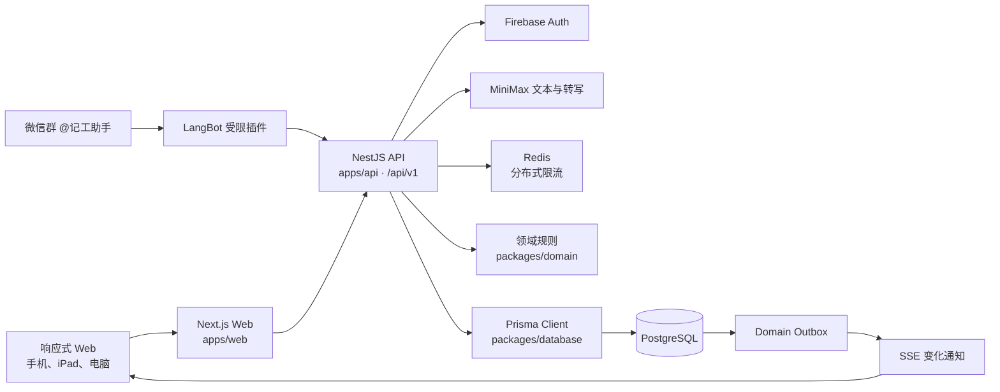

# 当前架构

> 状态：与 `1.22.1` 代码结构核对。
> 本文描述当前实现；项目开始时的设计草案见 [`archive/INITIAL_ARCHITECTURE_PLAN.md`](../archive/INITIAL_ARCHITECTURE_PLAN.md)。

Massage note 是一个 pnpm workspace 管理的 TypeScript 模块化单体。Web、API 和共享包在同一仓库开发与测试，生产可以按 Web/API 双容器运行，也可以在群晖单镜像中同时运行。

## 系统全景



核心原则：PostgreSQL 是业务真相来源；SSE 只通知客户端重新读取 REST；AI 只生成候选参数或解释确定性查询结果。

## 仓库边界

| 路径 | 职责 | 不应承担 | 保留原因 |
| --- | --- | --- | --- |
| `apps/web` | Next.js App Router、响应式中英文 UI、API 客户端和本地草稿 | 最终权限判断、最终财务计算 | 客户端展示不能授予权限或决定最终金额。 |
| `apps/api` | REST、认证、授权、事务、领域编排、审计、outbox、SSE 和 AI 网关 | 浏览器展示状态、任意 SQL AI 工具 | 服务端协调多个客户端的授权与事务。 |
| `apps/messages-agent` | 固定 Mac 上领取个人日结和员工区间结算任务、渲染附件、受限暂存并调用 Messages AppleScript | 入站端口、聊天数据库读写、键盘/窗口自动化 | 本机权限 App 和出站领取是现有发送路径。 |
| `integrations/langbot-plugin` | 拦截指定微信群记工消息、受限解析意图并调用专用记工接口 | 直接读取数据库、决定价格/员工、调用其他业务接口 | 模型仅产生受限意图，财务事实由后端决定。 |
| `packages/domain` | 无框架依赖的营业日、权限、提成、金额与财务纯函数 | Prisma、HTTP、React、环境变量 | 纯函数可在多个入口复用并独立验证。 |
| `packages/contracts` | 前后端共享的 Zod 请求契约和类型 | 数据库访问、业务副作用 | 共享校验避免调用端各定义一套输入。 |
| `packages/database` | Prisma schema、生成客户端、向前迁移和数据库约束测试 | HTTP 或 UI 逻辑 | 持久结构和迁移需有统一版本历史。 |
| `docker` | PostgreSQL 初始化、运行账号加固和 NAS 入口 | 应用业务规则 | 运行身份与启动顺序属于部署边界。 |
| `scripts` | 测试库准备、版本与文档链接检查、备份、恢复、维护和离线镜像 | 在线请求处理 | 维护命令不能混入在线事务。 |

依赖方向保持为“应用依赖共享包”：保留原因：共享包须被多个应用复用，反向依赖会绑定框架或数据库。

```text
apps/web ────────> packages/contracts
apps/web ────────> packages/domain
apps/api ────────> packages/contracts
apps/api ────────> packages/domain
apps/api ────────> packages/database

packages/domain     不依赖应用或数据库
packages/contracts  只依赖 Zod
```

## Web 结构

当前公开路由只有以下页面，店铺和营业日大多通过查询参数与页面状态表达，不使用旧设计中的 `/s/[storeId]/...` 路由：

| 路径 | 入口组件 | 用途 |
| --- | --- | --- |
| `/` | `massage-note-app.tsx`、`today-board.tsx` | 今日/历史营业日、记工、礼物卡销售与跑客记录 |
| `/finance` | `finance-page-client.tsx` | 汇总、明细、日结、现金与工资结算 |
| `/manage` | `manage-page-client.tsx`、`manage/members-panel.tsx` | 店铺、成员、目录、提成、回收站和审计；成员操作使用独立原生 dialog，草稿与实时名单分别持有 |
| `/profile` | `profile-page-client.tsx` | 资料、密码、店铺切换和会话退出 |
| `/login` | `login-form.tsx` | 手机验证码、密码和受控开发登录 |
| `/assistant` | `assistant-page-client.tsx` | 兼容旧书签；主入口是业务页悬浮助手 |
| `/help`、`/offline` | 页面组件 | 中英文帮助和断网说明 |

财务页面内部复用的日期截取与 UTC 日期加减放在 `apps/web/app/finance/date-utils.ts`。

Web 视觉按 `globals.css`（基础规则与颜色变量）、`design-system.css`（共享视觉与轻动效）、`responsive.css`（断点布局）顺序加载。`app/ui/primitives.tsx` 复用 SVG 图标、品牌与指标；`app-nav.tsx` 用同一组菜单呈现桌面自动收缩侧栏和小屏底栏，保留店铺参数与导航高度测量。桌面主区域只预留 64px，侧栏通过 CSS 悬停或 `:focus-visible` 展开至 216px 并覆盖内容，鼠标点击焦点不会使其常驻。`lib/app-navigation.ts` 统一角色菜单，`use-navigation-tab.ts` 同步 URL 与页面分区；桌面财务与店铺设置父项使用按钮独立切换子目录，默认收起；子项保留原生深链接，仅当前页面的普通点击使用分区回调。小屏父项仍为页面链接，并使用页面标签。成员页由 `manage/members-panel.tsx` 组织员工目录、选中档案与确认表单，`lib/member-management.ts` 验证完整草稿后依次提交资料和提成版本接口；DOM 流程测试使用 React/jsdom，不启动浏览器。记工辅助模块的外观由 `.board-panel` 维护，成员 fieldset 的标题与内容分别布局；`scripts/check-ui-styles.mjs` 检查颜色/圆角变量与断点覆盖边界。设计依据见 [UI 设计](UI_DESIGN.md)。保留原因：实际入口、样式层叠和生命周期已有公共实现，重复实现会失去一致性。

`apps/web/lib` 放共享客户端能力：

- `api.ts`：登录、业务请求与实时连接共用的 API 基址，以及统一 Cookie 请求、幂等键、错误翻译和目录名称注册。
- `i18n.ts`：界面词条、稳定错误码翻译和自定义项目名称映射。
- `types.ts`：部分手写响应类型；角色、每周排工和结算范围复用领域/契约类型，其余响应变化时必须同步。保留原因：实际入口、样式层叠和生命周期已有公共实现，重复实现会失去一致性。
- `money.ts`、`time.ts`、`closing.ts` 等：无 UI 的显示与状态辅助函数及测试。
- `realtime.ts` / `realtime-client.ts`：同页面同店共享 SSE 连接，串行合并 REST 重载；心跳停顿 10 秒重建连接，异常期间每 30 秒补读，隐藏或离线时暂停，恢复可见/联网时完整补读。`realtime-scope.ts` 按实体与营业日选择刷新范围。
- `business-date-calendar-cache.ts`：主页持有按店铺/月分组的内存缓存，最多十二个月，合并同月在途请求，跨表格重挂载保留；切日期复用日历、目录与成员资料，重新读取目标表格。本机业务操作、手动刷新与跨日清空缓存；自动同步和重新联网的完整补读只刷新业务资料，不重新获取已读日历，其他设备造成的标记变化在手动刷新后更新；旧请求不能回填失效缓存。新面板订阅 SSE 只初始化自身，不触发已订阅主页完整补读。缓存不写入浏览器存储，切店重新初始化，财务日历沿用打开时读取。保留原因：实际入口、样式层叠和生命周期已有公共实现，重复实现会失去一致性。

浏览器本地存储只保存语言、当前店铺偏好和最多七天的未提交详情草稿；不注册 Service Worker，也不提供浏览器安装入口。

## API 模块

`apps/api/src/app.module.ts` 组合以下模块：

| 模块 | 主要职责 |
| --- | --- |
| `auth` | Firebase ID token、密码、CSRF、会话 Cookie 与撤销 |
| `users` | 当前用户资料与密码更新 |
| `stores` | 店铺、成员、加入申请、目录、提成和店铺访问检查 |
| `boards` | 营业日、班次、每日表格行和每日开门排位 |
| `work-records` | 记工快照、付款确认、软删除与恢复 |
| `gift-cards` | 卖卡、序列号、折扣快照和使用台账 |
| `lost-customers` | 跑客时间、人数、备注、Walk-in 来源与审计快照 |
| `work-bot` | 微信机器人群/员工绑定、受限意图提交、查询与管理 |
| `finance` | 财务查询、日结、现金结算和工资账本 |
| `audit` | 按店查询不可变审计日志 |
| `realtime` | PostgreSQL outbox 的 SSE 事件流 |
| `ai` | 记工预览、确定性财务解释和短录音转写 |

`work-bot` 的金额解析与回复格式化放在 `work-bot-format.ts`，Service 保留权限和事务编排。生成图片的 XML 转义、金额和时间显示由 `packages/domain/src/image-format.ts` 共用，工资结算与个人日结的主题、换行及表面绘制由 `image-layout.ts` 共用。区间结算纯 SVG 排版位于 `employee-settlement-image.ts`，Web 在本机转换 PNG 并预览／保存，Mac 代理转换受大小限制的 JPEG 发送。个人日结纯 SVG 排版位于 `employee-closing-image.ts`，固定 1170 像素源宽；Web `lib/employee-closing-image.ts` 保留设备像素适配及分享／下载，Mac `src/render.ts` 通过 `sips` 转换 PNG。两端按对象与日期、已确认收入、来源分组和时间顺序明细读取同一快照，员工小计仍有自己的渲染布局。日结与区间结算发送共用 `finance/delivery-agent.ts` 的凭证哈希与鉴权，租约状态仍由 `delivery-lease.ts` 和各 Service 检查。保留原因：共用纯排版避免 Web 与短信内容或审美分叉，图片转换与发送环境各自保留边界，最终权限和金额仍由服务端控制。

Controller 只负责 HTTP 适配和共享契约解析。权限、对象归属、状态与事务放在 Service 或领域函数中；金额最终值不信任前端合计。保留原因：权限和金额最终判断须在服务端，不能靠界面或客户端参数实现。

## 典型写入链路

```text
Web 表单
  → packages/contracts Zod 校验
  → Nest Controller
  → 会话、店铺成员与角色检查
  → Idempotency-Key / version / 营业日锁
  → Prisma transaction
      ├─ 业务数据或快照
      ├─ audit_logs
      └─ domain_outbox
  → JSON 安全响应
  → SSE 通知其他设备重新读取 REST
```

同一店铺营业日的记工、表格、日结和现金结算使用 `common/business-day-lock.ts` 的事务级 advisory lock。可修改资源使用 `version` 乐观锁，关键写入使用 `Idempotency-Key`；批量流程也必须保持审计和 outbox 与业务数据同事务。保留原因：并发写入、关账和批量操作须保持相同锁与事务边界。

### 占位数据流

快速记工占位复用 `WorkRecord` 的日期、员工、顺序时间、版本与软删除字段，以 `PLACEHOLDER` 状态单独判别，不新增零元项目或付款快照。创建请求的 `isPlaceholder: true` 分支跳过项目、提成、折扣与现金结清回退，更新和付款入口显式拒绝；删除恢复复用原权限、营业日锁、幂等、审计和 outbox。数据库只追加枚举和占位字段约束的前向迁移，既有记录保持原状态。保留原因：持久化标记需复用跨设备与恢复边界，不能混入账目。

看板读出占位并保护其员工行，统计与日历聚合排除；财务、工资、日结、经营分析、机器人和 AI 记工上下文在数据源查询时排除占位，避免二分付款状态把新状态误当已付款或待结账。Web 在普通卡片分支前单独渲染铺满整卡的两条 SVG 对角线与格式化的所选时间，并使用专用删除确认弹窗。保留原因：卡片位置和服务事实有不同消费范围，源头过滤避免虚假工数、工资变更和工作占用。

## 财务与历史数据

- 持久金额使用整数美分；领域层最终运算使用 `bigint`，提成使用 basis points。保留原因：整数美分避免浮点误差，万分比精确表达提成。
- 公式事实来源是 `packages/domain/src/finance.ts`，金额格式化不是账本计算。保留原因：格式化只改变展示，不应产生第二套账目算法。
- 记工创建时保存项目、时长、价格、折扣、提成及来源、工资、时区和营业日截止快照。保留原因：历史读取依赖发生时内容，而非当前目录。
- 修改目录或提成不能重写已日结历史；允许的当前营业日重算必须经过服务端流程。保留原因：金额、支付账本和历史快照各有来源，不能被格式化或最新设置替代。
- 日结、现金结算和工资结算是不同账本/状态，不应合并成一个可覆盖总数。工资登记通过 `PayrollEntryForm` 统一员工、日期范围、金额和工资来源；日历付款由 `EmployeeSettlementPaymentsService` 计算未结金额及 revision，在 Serializable 事务中获取相关营业日锁、校验修订并保存实付账本、审计及幂等结果。`PayrollSettlementConfirmation` 一对一关联账本，只保存确认时未结金额与手工抵扣，员工、范围、来源及软删除状态读取父账本，避免修改/恢复不同步。领域函数 `settlement-calendar.ts` 合并范围确认和每日现金已取得收入；单据/短信继续沿用完整记工快照。手工及历史工资账本不推断结清确认，旧来源保持未知。保留原因：金额、支付账本和历史快照各有来源，不能被格式化或最新设置替代。
- 详细产品口径见 [`PRODUCT.md`](../product/PRODUCT.md)。

## 认证、安全与隔离

- 生产认证链路为 Firebase Phone Auth 或密码换 Custom Token，最后都用 Firebase ID token 建立服务端 `HttpOnly` 会话。保留原因：两种登录入口最终必须接受相同会话和撤销检查。
- Cookie 写请求校验精确 `Origin`；登录初始化另有双提交 CSRF。保留原因：Cookie 会自动携带，写入需额外验证请求来源。
- 每个业务 Service 重新验证活跃成员、角色能力、对象 `storeId` 和营业日状态。保留原因：有效成员与对象归属共同执行当前租户隔离。
- 数据库迁移账号与应用账号分离；应用账号不能 DDL，也不能改写审计、AI 日志和 outbox 历史。保留原因：当前成员、对象作用域和运行账号才是现行隔离机制。
- 当前不使用依赖连接会话变量的 PostgreSQL RLS；完整边界见 [`SECURITY.md`](../operations/SECURITY.md)。保留原因：连接池没有请求级会话变量保证，旧 RLS 计划不代表已实施。

## 运行与部署形态

| 场景 | 形态 |
| --- | --- |
| 本地开发 | Next.js `:3000` + NestJS `:4000` + Docker PostgreSQL/Redis |
| 普通生产 Compose | 独立 `web` 与 `api` 容器，端口只绑定 loopback |
| 群晖 | 一个 `nas` 应用镜像同时启动 Web/API；Next.js 把 `/api/*` 代理到容器内 API |
| 固定 Mac | LaunchAgent 只向 NAS 发出 HTTPS 请求；通过 LaunchServices 以 FDA 授权的无界面 App 身份暂存已验证的 PNG/JPEG，核对任务结果与固定 Messages 路径后只由 AppleScript 静默发送附件，不模拟界面操作 |

数据库迁移在应用启动前由一次性 `migrate` 服务执行，随后 `harden` 服务收紧应用账号权限。CI 在每次 push/PR 执行版本与本地文档链接检查、工具测试、类型检查、单元测试、数据库/API 集成测试和生产构建；`main` 验证成功后再发布 `linux/amd64` NAS 镜像。

## 修改位置速查

| 变化类型 | 首要位置 | 必须联动 | 保留原因 |
| --- | --- | --- | --- |
| 财务公式 | `packages/domain/src` | domain 测试、API 查询、产品文档、UI 说明 | 调用端必须使用相同账目口径。 |
| 请求字段 | `packages/contracts/src` | 契约测试、Controller、Service、Web 类型、API 文档 | 多个调用端须采用同一契约。 |
| 数据模型 | Prisma schema + 新迁移 | 约束/集成测试、服务、部署说明 | 已有数据库需要可重放的升级路径。 |
| 权限 | `packages/domain/src/permission.ts`、`store-access.service.ts` | 正常、越权与跨店集成测试 | 越权与跨店失败也应验证。 |
| 页面行为 | `apps/web/app` | 中英文、手机/iPad/桌面和交互测试 | 不同语言和宽度共用业务流程。 |
| 实时事件 | 写事务、outbox、`realtime` | REST 重载和断线恢复 | 事件只通知重新读取业务真相。 |
| AI | `apps/api/src/ai` | canonical preview、确认鉴权、限流和安全降级 | 候选预览不能跳过确认和权限。 |

具体开发与验证流程见 [`DEVELOPMENT.md`](DEVELOPMENT.md)，HTTP 端点见 [`API.md`](API.md)。

## AI 会话上下文

`AiConversation` 绑定店铺、用户和助手类型；`AiQueryLog` 的现有 JSON 结果字段保存回复、查询结果、预览和成员权限范围，无需数据库迁移。每次带 `conversationId` 的请求先验证归属，再读取非 ERROR 历史，按角色和时间顺序交给模型供应商；记工只读工具循环保留同一份历史。角色/成员范围变化会排除先前范围的结果。保留原因：历史仅辅助理解，业务结果和写入仍须重新读取及鉴权。

财务助手在有历史且模型可用时，先结合历史解析当前完整筛选，再调用后端财务服务并解释最新统计。历史仅帮助理解追问，不能替代业务鉴权、确定性计算或写入确认。接口细节及旧日志兼容限制见 [API 文档](API.md)。保留原因：历史仅辅助理解，业务结果和写入仍须重新读取及鉴权。

个人日结逐人短信使用独立营业日与可空日结周期，未日结也能保存并发送快照；个人“已结现金”复用 DailyCashSettlement 和原有审计/outbox 路径。

### 日结定时任务

`ClosingSchedulerService` 随 API 启停，每 15 秒扫描活跃店铺，仅在店铺时区的 23:30 分钟调用 `ClosingsService.close` 的内部自动模式；运行中的扫描不重叠，各店铺失败互不阻塞。任务以店主有效账号执行，审计来源为 `scheduler`，不受浏览器设备时间影响。无有效店主账号时跳过。

自动模式在营业日 advisory lock 内检查所有异常和已有日结周期；确定性幂等键加营业日锁支持重复扫描及多 API 实例。首次日结在同一事务创建个人小结快照、发送任务及审计，审计触发器同步生成 outbox。去重按店铺、营业日、成员检查 SENT/QUEUED/CLAIMED，覆盖未关联日结的手动发送。未新增数据库迁移或外部 cron 服务。

### 实时同步资源与恢复

每个 API 实例按店铺共享一条 2 秒 outbox 轮询（事件查询次数不随连接数增加），每个订阅仍独立检查成员与账号权限。共享流不按账号去重；最后一个连接离开时释放轮询，实例关闭时释放全部流。新订阅立即要求完整 REST 同步，原 `Last-Event-ID` 仍兼容；同店已有共享游标时以完整同步补齐加入前的状态。每 30 秒保留迟提交事务兜底通知。保留原因：共享轮询不能削弱独立连接权限，REST 失败与草稿须分别处理。

浏览器只有收到实际事件/心跳且 REST 读取成功才显示已同步。连续通知在 250 毫秒窗口内合并，读取中收到变化会排队补读；失败读取即使心跳正常也会低频重试。记工页的已知记工/表格事件只重读所选日期的表格，财务页重读相关汇总、明细与结算，管理页只更新已删除记工列表；未知事件与重连仍完整刷新。不重新挂载记工编辑器，保留草稿及版本冲突校验。保留原因：共享轮询不能削弱独立连接权限，REST 失败与草稿须分别处理。

记工与机器人上工共用 `apps/api/src/common/automatic-discounts.ts` 的自动折扣判断。保留原因：同一店铺、营业日期和金额应生成相同折扣快照，避免两个入口各自维护规则。`WorkRecordsService` 新建及编辑时排除高亮记工的自动折扣，机器人高亮操作复用该编辑服务；Web 详情预览同步排除，手动折扣与单笔手动停用状态保留。


### 经营分析

`FinanceAnalyticsService` 在 RepeatableRead 只读事务中验证店铺财务权限并读取当前店铺有效记工、跑客、卖卡及去重后的已日结日期。独立 `highlightFilter` 在数据库读取时统一筛选记工及均线窗口，仅高亮排除店铺级卖卡，跑客与日结样本不受影响。每日记工数量响应同时包含按有效跑客记录 `customerCount` 求和的 `lostCustomerCount`；仅有跑客而没有记工的日期也纳入日期序列。领域函数 `calculateFinanceAnalytics` 负责历史时区小时分组、自然日补零及整数美分平均；共享契约 `FinanceAnalyticsResponse` 仅传输聚合结果。Web独立分析标签按需加载，通过既有实时通道与刷新队列合并事件，并使切店、日期/高亮条件变化和卸载后的旧请求失效。 `AnalyticsDailyReport` 复用该响应的日期边界与高光条件读取既有财务汇总和每日明细；`AnalyticsRevenueCalendar` 直接展示过滤后的 `days[].revenueCents` 并沿用今日记工样式，月份切换不另取未筛选数据。每日小计与明细采用独立刷新队列和过期响应隔离，明细弹层与财务汇总共用 `FinanceDetailsDialog`。跑客数据由独立数据库表和向前迁移维护；可选备注保存于 `LostCustomer.note`，直接到店来源保存于 `LostCustomer.isWalkIn`（旧记录及新增默认 `false`）；两者随列表和审计快照返回，不进入数量或金额计算。保留原因：聚合按历史日期和快照读取，展示不能重算当时归属，过期筛选结果不能覆盖当前图表。

每日开门排位由领域层 `explainRotationCandidates` 复用排序函数生成结构化比较依据，API 与最终顺序一起事务保存至 `daily_boards.ranking_explanation`。读取使用共享契约校验并限制管理权限，Web 以中英文固定文案展示快照及当前名单差异，不依赖 AI 或当前历史重新推算。新增字段使用向前迁移，已有排序快照为空。

## 每周排工与折扣目录

每周排工模板保存在店铺，营业日表格记录首次应用标记。看板加载前通过 API 在营业日锁内补入模板人员，生成既有轮转排位解释并写审计与 outbox；未来日期加载时按最新模板同步自动加入的行并重算顺序，无变化不写入；今天已安排的人员和人工调整保留。未来看板依据 `board.rows_reordered` / `board.rows_ranked` 审计的 `afterJson.version` 判断最新调序操作，避免同毫秒时间或 UUID 顺序造成误判；手动调序后只同步名单，新增人员追加到末尾，不重排已有人员，主动重新生成后恢复自动顺序更新。复用已有审计，无需新增数据库字段或迁移。每周模板立即生效，今天即可查看明天；历史及已日结看板不应用。单日手动移除依据该营业日最近的 `board.row_removed` / `board.row_added` 审计快照中的成员 ID 排除模板自动补入，手动重新添加解除排除；隐藏空行移除使用同一审计口径。保留原因：审计与结清快照保存人工意图和发薪事实，加载不能覆盖历史。

弹窗“应用”通过 `replace-weekly-dispatch` 使用当前勾选覆盖所选日期，不保存模板；目标日期已有记工（含待结账或删除历史）、已日结或属于历史时拒绝并回滚。覆盖标记让后续自动加载保留该日期的人工结果。保留原因：审计与结清快照保存人工意图和发薪事实，加载不能覆盖历史。

`discount_items.rate_bps` 为可空万分比；预设折扣与自定义折扣复用既有记工比例快照和领域金额计算。礼物卡台账从已确认记工按规范化序列号分组补入无销售登记的老卡，查询不产生销售账目。


成员 `StoreMembership.dailySettlementEnabled` 默认为 false。每日全额结清沿用 `CashSettlementsService` 的营业日锁、版本、幂等和审计，结清快照存入 `DailyCashSettlement`，额外工资与非现金小费分开保存，原现金收取/留存字段保留各自含义。金额由 domain `calculateDailyFullSettlement` 计算，现金小费不进入交接金额但计入员工已经取得的收入；工资余额仅追加额外已发部分，避免重复扣现金工资。工资日历合并有效每日全额结清快照，确认两种来源；自动回退以原状态为准使快照失效，无需回写独立工资账本。已结快照不读取后来成员设置；结清期间以成员共享行锁串行化设置更新，已有工资确认和待结账记工阻止全额日结。保留原因：审计与结清快照保存人工意图和发薪事实，加载不能覆盖历史。

## 店铺支出数据流

财务 `expenses` 标签使用独立 `ExpensesPanel`，按店铺和自然月请求；复用 LatestRequest、刷新队列和实时订阅。切换月份/店铺或卸载时使旧请求失效。`expense_item` 事件仅刷新支出，避免重查收入和日结。

`FinanceModule` 的 ExpensesController/Service 通过共享支出契约接受操作，以 `EXPENSE_MANAGE` 检查店主/经理权限与店铺归属。数据库新增 ExpenseItem、ExpenseRuleRevision、ExpensePeriodOverride；项目版本为规则和单期覆盖操作的统一乐观锁，并在同一幂等事务中更新版本、业务数据及审计，现有审计触发器创建 outbox。支出不锁营业日、不重写日结快照。

领域 `calculateExpenseMonth` 使用 BigInt，按查询月份直接定位相交周期，不从首次费用逐日扫描。月周期以整月为分摊单位，天周期以自然日为单位，余数归较早单位。实际单期覆盖优先于规则默认值；软删除项目不参与汇总。前端只格式化金额和编辑输入，不重新计算月成本。
